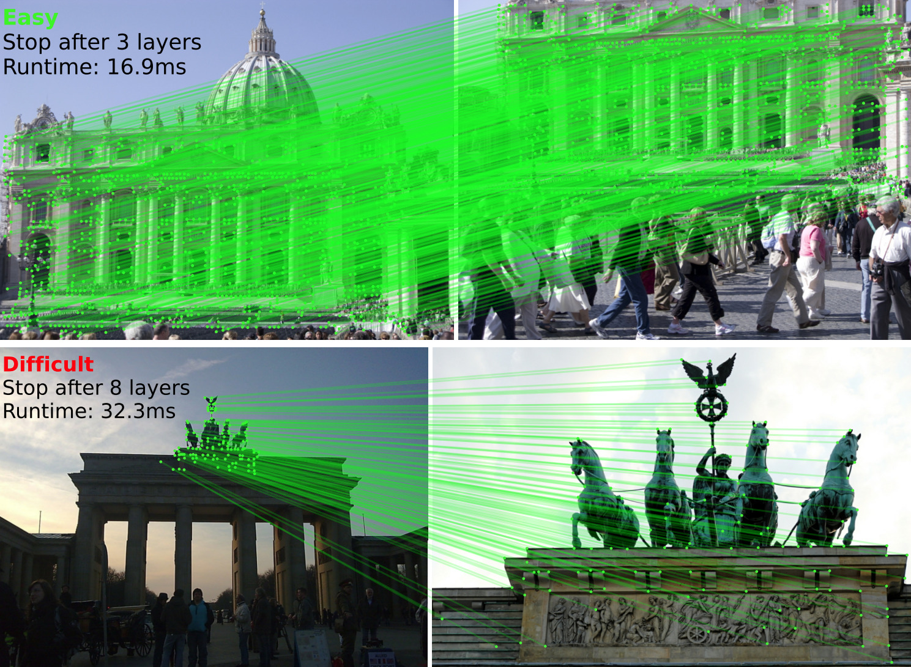
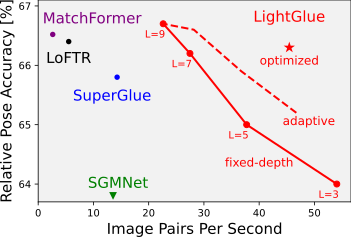

<p align="center">
  <h1 align="center"><ins>LightGlue</ins><br>Local Feature Matching at Light Speed</h1>
  <p align="center">
    <a href="https://www.linkedin.com/in/philipplindenberger/">Philipp Lindenberger</a>
    ·
    <a href="https://psarlin.com/">Paul-Edouard&nbsp;Sarlin</a>
    ·
    <a href="https://www.microsoft.com/en-us/research/people/mapoll/">Marc&nbsp;Pollefeys</a>
  </p>
<!-- <p align="center">
    
</p> -->
  <!-- <h2 align="center">PrePrint 2023</h2> -->
  <h2><p align="center"><a href="https://arxiv.org/pdf/2306.13643.pdf" align="center">Paper</a></p></h2>
  <div align="center"></div>
</p>
<p align="center">
    <a href="https://arxiv.org/abs/2306.13643"></a>
    <br>
    <em>LightGlue is a Graph Neural Network for local feature matching that introspects its confidences to 1) stop early if all predictions are ready and 2) remove points deemed unmatchable to save compute.</em>
</p>

##

This repository hosts the inference code for LightGlue, a lightweight feature matcher with high accuracy and adaptive pruning techniques, both in the width and depth of the network, for blazing fast inference. It takes as input a set of keypoints and descriptors for each image, and returns the indices of corresponding points between them.

We release pretrained weights of LightGlue with [SuperPoint](https://arxiv.org/abs/1712.07629) and [DISK](https://arxiv.org/abs/2006.13566) local features.

The training end evaluation code will be released in July in a separate repo. If you wish to be notified, subscribe to [Issue #6](https://github.com/cvg/LightGlue/issues/6).

## Installation and Demo

You can install this repo pip:

```bash
git clone https://github.com/cvg/LightGlue.git && cd LightGlue
python -m pip install -e .
```

We provide a [demo notebook](demo.ipynb) which shows how to perform feature extraction and matching on an image pair.

Here is a minimal script to match two images:

```python
from lightglue import LightGlue, SuperPoint, DISK
from lightglue.utils import load_image, match_pair

# SuperPoint+LightGlue
extractor = SuperPoint(max_num_keypoints=2048).eval().cuda()  # load the extractor
matcher = LightGlue(pretrained='superpoint').eval().cuda()  # load the matcher

# or DISK+LightGlue
extractor = DISK(max_num_keypoints=2048).eval().cuda()  # load the extractor
matcher = LightGlue(pretrained='disk').eval().cuda()  # load the matcher

# load images to torch and resize to max_edge=1024
image0, scales0 = load_image(path_to_image_0, resize=1024)
image1, scales1 = load_image(path_to_image_1, resize=1024)

# extraction + matching + rescale keypoints to original image size
pred = match_pair(extractor, matcher, image0, image1,
                  scales0=scales0, scales1=scales1)    

kpts0, kpts1, matches = pred['keypoints0'], pred['keypoints1'], pred['matches']
m_kpts0, m_kpts1 = kpts0[matches[..., 0]], kpts1[matches[..., 1]]
```

## Tradeoff Speed vs. Accuracy
LightGlue can adjust its depth (number of layers) and width (number of keypoints) per image pair, with a minimal impact on accuracy.
<p align="center">
  <a href="https://arxiv.org/abs/2306.13643"></a>
</p>

- [```depth_confidence```](https://github.com/cvg/LightGlue/blob/release/lightglue/lightglue.py#L265): Controls early stopping, improves run time. Recommended: 0.95. Default: -1 (off) 
- [```width_confidence```](https://github.com/cvg/LightGlue/blob/release/lightglue/lightglue.py#L266): Controls iterative feature removal, improves run time. Recommended: 0.99. Default: -1 (off)
- [```flash```](https://github.com/cvg/LightGlue/blob/release/lightglue/lightglue.py#L262): Enable [FlashAttention](https://github.com/HazyResearch/flash-attention/tree/main). Significantly improves runtime and reduces memory consumption without any impact on accuracy, but requires either [FlashAttention](https://github.com/HazyResearch/flash-attention/tree/main) or ```torch >= 2.0```.


## LightGlue in other frameworks
- ONNX: [fabio-sim](https://github.com/fabio-sim) was blazing fast in implementing an ONNX-compatible version of LightGlue [here](https://github.com/fabio-sim/LightGlue-ONNX).


## BibTeX Citation
If you use any ideas from the paper or code from this repo, please consider citing:

```txt
@inproceedings{lindenberger23lightglue,
  author    = {Philipp Lindenberger and
               Paul-Edouard Sarlin and
               Marc Pollefeys},
  title     = {{LightGlue}: Local Feature Matching at Light Speed},
  booktitle = {ArXiv PrePrint},
  year      = {2023}
}
```
