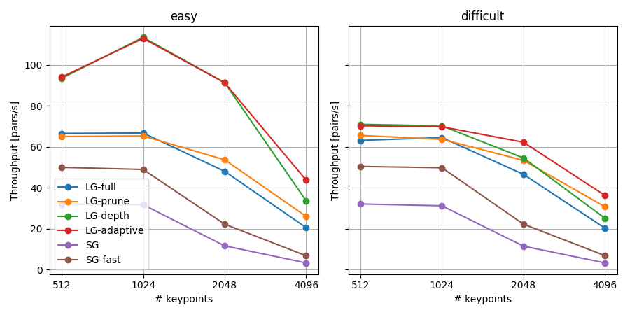
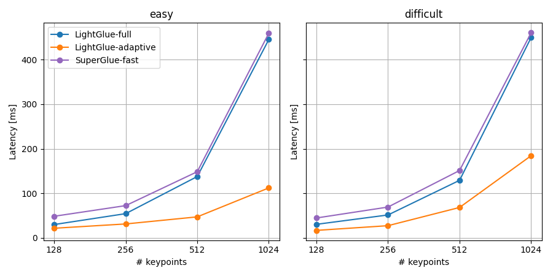

<p align="center">
  <h1 align="center"><ins>LightGlue ⚡️</ins><br>Local Feature Matching at Light Speed</h1>
  <p align="center">
    <a href="https://www.linkedin.com/in/philipplindenberger/">Philipp Lindenberger</a>
    ·
    <a href="https://psarlin.com/">Paul-Edouard&nbsp;Sarlin</a>
    ·
    <a href="https://www.microsoft.com/en-us/research/people/mapoll/">Marc&nbsp;Pollefeys</a>
  </p>
<!-- <p align="center">
    
</p> -->
  <!-- <h2 align="center">PrePrint 2023</h2> -->
  <h2 align="center"><p>
    <a href="https://arxiv.org/pdf/2306.13643.pdf" align="center">Paper</a> | 
    <a href="https://colab.research.google.com/github/cvg/LightGlue/blob/main/demo.ipynb" align="center">Colab</a>
  </p></h2>
  <div align="center"></div>
</p>
<p align="center">
    <a href="https://arxiv.org/abs/2306.13643"></a>
    <br>
    <em>LightGlue is a deep neural network that matches sparse local features across image pairs.<br>An adaptive mechanism makes it fast for easy pairs (top) and reduces the computational complexity for difficult ones (bottom).</em>
</p>

##

This repository hosts the inference code of LightGlue, a lightweight feature matcher with high accuracy and blazing fast inference. It takes as input a set of keypoints and descriptors for each image and returns the indices of corresponding points. The architecture is based on adaptive pruning techniques, in both network width and depth - [check out the paper for more details](https://arxiv.org/pdf/2306.13643.pdf).

We release pretrained weights of LightGlue with [SuperPoint](https://arxiv.org/abs/1712.07629) and [DISK](https://arxiv.org/abs/2006.13566) local features.
The training end evaluation code will be released in July in a separate repo. To be notified, subscribe to [issue #6](https://github.com/cvg/LightGlue/issues/6).

## Installation and demo [](https://colab.research.google.com/github/cvg/LightGlue/blob/main/demo.ipynb)

Install this repo using pip:

```bash
git clone https://github.com/cvg/LightGlue.git && cd LightGlue
python -m pip install -e .
```

We provide a [demo notebook](demo.ipynb) which shows how to perform feature extraction and matching on an image pair.

Here is a minimal script to match two images:

```python
from lightglue import LightGlue, SuperPoint, DISK
from lightglue.utils import load_image, rbd

# SuperPoint+LightGlue
extractor = SuperPoint(max_num_keypoints=2048).eval().cuda()  # load the extractor
matcher = LightGlue(features='superpoint').eval().cuda()  # load the matcher

# or DISK+LightGlue
extractor = DISK(max_num_keypoints=2048).eval().cuda()  # load the extractor
matcher = LightGlue(features='disk').eval().cuda()  # load the matcher

# load each image as a torch.Tensor on GPU with shape (3,H,W), normalized in [0,1]
image0 = load_image('path/to/image_0.jpg').cuda()
image1 = load_image('path/to/image_1.jpg').cuda()

# extract local features
feats0 = extractor.extract(image0)  # auto-resize the image, disable with resize=None
feats1 = extractor.extract(image1)

# match the features
matches01 = matcher({'image0': feats0, 'image1': feats1})
feats0, feats1, matches01 = [rbd(x) for x in [feats0, feats1, matches01]]  # remove batch dimension
matches = matches01['matches']  # indices with shape (K,2)
points0 = feats0['keypoints'][matches[..., 0]]  # coordinates in image #0, shape (K,2)
points1 = feats1['keypoints'][matches[..., 1]]  # coordinates in image #1, shape (K,2)
```

We also provide a convenience method to match a pair of images:

```python
from lightglue import match_pair
feats0, feats1, matches01 = match_pair(extractor, matcher, image0, image1)
```

##

<p align="center">
  <a href="https://arxiv.org/abs/2306.13643"></a>
  <br>
  <em>LightGlue can adjust its depth (number of layers) and width (number of keypoints) per image pair, with a marginal impact on accuracy.</em>
</p>

## Advanced configuration

The default values give a good trade-off between speed and accuracy. To maximize the accuracy, use all keypoints and disable the adaptive mechanisms:
```python
extractor = SuperPoint(max_num_keypoints=None)
matcher = LightGlue(features='superpoint', depth_confidence=-1, width_confidence=-1)
```

To increase the speed with a small drop of accuracy, decrease the number of keypoints and lower the adaptive thresholds:
```python
extractor = SuperPoint(max_num_keypoints=1024)
matcher = LightGlue(features='superpoint', depth_confidence=0.9, width_confidence=0.95)
```
The maximum speed is obtained with [FlashAttention](https://arxiv.org/abs/2205.14135), which is automatically used when ```torch >= 2.0``` or if it is [installed from source](https://github.com/HazyResearch/flash-attention#installation-and-features).

To optimize inference with few keypoints, you can compile LightGlue:

```python
matcher = matcher.eval().cuda()
matcher.compile(mode='reduce-overhead')
```

This compiles LightGlue for a set of static input lengths (256, 512, 768, 1024, 1280, 1536 keypoints), with automatic padding for dynamic shapes. Above 1536 keypoints, the default python implementation is used. Note that this supports adaptive depth, but disables point pruning <1536 keypoints.

<details>
<summary>[Detail of all parameters - click to expand]</summary>

- ```n_layers```: Number of stacked self+cross attention layers. Reduce this value for faster inference at the cost of accuracy (continuous red line in the plot above). Default: 9 (all layers).
- ```flash```: Enable FlashAttention. Significantly increases the speed and reduces the memory consumption without any impact on accuracy. Default: True (LightGlue automatically detects if FlashAttention is available).
- ```mp```: Enable mixed precision inference. Default: False (off)
- ```depth_confidence```: Controls the early stopping. A lower values stops more often at earlier layers. Default: 0.95, disable with -1.
- ```width_confidence```: Controls the iterative point pruning. A lower value prunes more points earlier. Default: 0.99, disable with -1.
- ```filter_threshold```: Match confidence. Increase this value to obtain less, but stronger matches. Default: 0.1

</details>


We provide a [benchmark script](https://github.com/cvg/LightGlue/blob/main/benchmark.py) which evaluates the inference time on test images. 

```
python benchmark.py [--device cuda] [--add_superglue] [--num_keypoints 512 1024 2048 4096] [--compile]
```
<details>
<summary>[Benchmark results - click to expand]</summary>

<p align="center">
  <a></a>
  <br>
  <em>Benchmark results on RTX 3080. With compilation and adaptivity, LightGlue achieves 150/50 FPS with 1024/4096 keypoints per image, respectively. This equals 4-10x speedup over SuperGlue and almost linear scaling. </em>
</p>

<p align="center">
  <a></a>
  <br>
  <em>Benchmark results on Intel i7 10700K. On a standard CPU, LightGlue matches image pairs at 20 FPS with 512 keypoints.</em>
</p>

Note: **Point pruning** requires gathering descriptors during the forward pass, and this overhead eliminates the benefits of point pruning in some cases (= few keypoints). Consequently, point pruning is only used when there are more than N keypoints in an image, where N depends on device / hardware used. The defaults we provide are for current hardware (RTX 30xx), and we suggest running the benchmark script once and to adjust the thresholds for your hardware accordingly.

</details>

## Other links
- [hloc - the visual localization toolbox](https://github.com/cvg/Hierarchical-Localization/): run LightGlue for Structure-from-Motion and visual localization.
- [LightGlue-ONNX](https://github.com/fabio-sim/LightGlue-ONNX): export LightGlue to the Open Neural Network Exchange format.
- [Image Matching WebUI](https://github.com/Vincentqyw/image-matching-webui): a web GUI to easily compare different matchers, including LightGlue.
- [kornia](https://kornia.readthedocs.io) now exposes LightGlue via the interfaces [`LightGlue`](https://kornia.readthedocs.io/en/latest/feature.html#kornia.feature.LightGlue) and [`LightGlueMatcher`](https://kornia.readthedocs.io/en/latest/feature.html#kornia.feature.LightGlueMatcher).

## BibTeX Citation
If you use any ideas from the paper or code from this repo, please consider citing:

```txt
@inproceedings{lindenberger2023lightglue,
  author    = {Philipp Lindenberger and
               Paul-Edouard Sarlin and
               Marc Pollefeys},
  title     = {{LightGlue: Local Feature Matching at Light Speed}},
  booktitle = {ICCV},
  year      = {2023}
}
```
